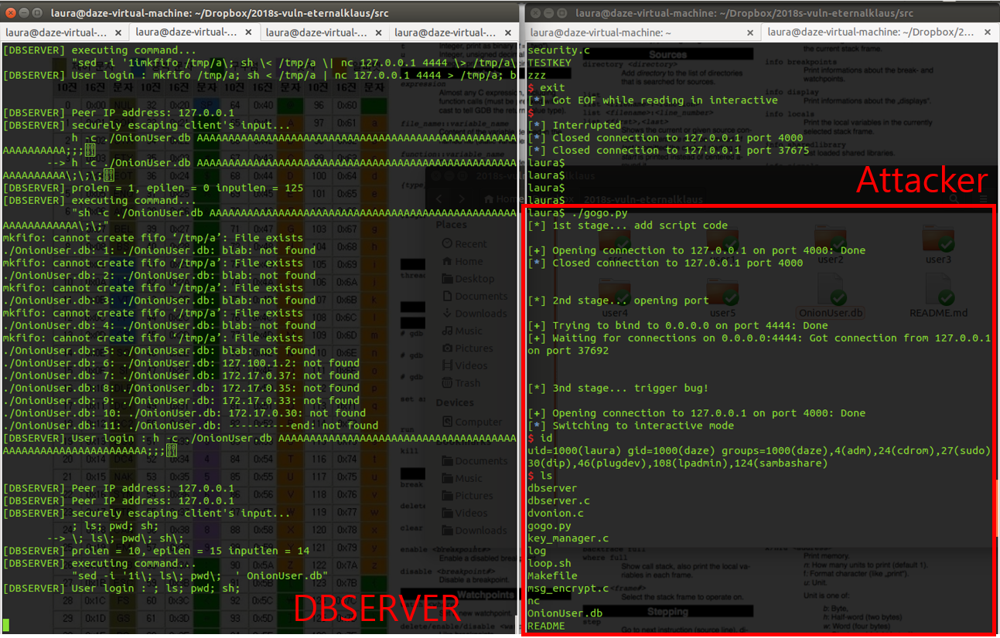

# Vulnerability
### Summery
- `Command injection filter` 를 우회하여 임의 커멘드 실행을 가능케 하는 익스플로잇입니다.  
- 모순적이게도 이는 `Command injection filter` 내부의 버퍼 관리 취약점 때문에 발생합니다.  
</br>
</br>

### Detail
1. Command injection filter인 escapeshell()의 버퍼 오버플로우 취약점이 발생  
2. `1`의 결과 커멘드 길이를 저장하는 변수 `prolen`, `epilen`가 를 조작할 수 있게 됨  
3. `2`의 결과 공격자는 `prolen`을 0보다 큰 값으로, `epilen`을 0으로 조작  
```
* 제약조건 
    * 모든 스트링은 strncpy로 전달되므로 페이로드에 0(NULL BYTE)를 사용할 수 없음
    * 따라서 공격자는 `prolen`은 1 이상의 값으로만 조작가능
    * prolog `"sed -i '1i"` 중 최소 1byte 이상이 복사됨
    * 그 결과 full command injection은 불가하다는 제약이 생김
* 해결
    * `prolen` 을 1로 조작
    * `"sed -i '1i"` 중 1바이트인 `"s"` 만 복사됨
    * `"s -c ..."`을 전달하면 `"sh -c ..."` 가 완성되어 임의커멘드 실행이 가능
```
4. 커멘드가 escape되는 문제  
```
* 제약조건 : 공격자가 주는 모든 커멘드는 escapeshell을 거쳐서 전달됨
    * 전달 페이로드 중 `;`도 escape 문자에 해당
    * 3번 결과 임의커멘드가 실행 가능한 상황까지 온다고 하더라도 공격자는 리버스쉘을 딸 수가 없음
* 해결 
    * `dbserver` 는 기본적으로 사용자가 전달하는 Ip, Port, GithubID를 `OnionUser.db` 에 추가는 역할을 함
    * 그런데 `OnionUser.db` 파일은 777 권한으로 관리되어 실행 가능한 파일이라는 특징을 가짐
    * 이걸 아는 공격자는 `dbserver`에 Ip, Port, GithubID 대신에 `스크립트 코드`를 여러 차례 전달
    * 임의 커멘드 실행 단계에서 공격자는 `./ OnionUser.db` 를 실행
    * 그 결과 여러 줄에 걸친 스크립트 코드가 실행되며 리모트쉘 획득
```
</br>
</br>

### Vulnerable code
```{.cpp}
void escapeshell(char *str){ // [BUG] str에서 dangerous char이 escaping되면서 최대 2배의 길이까지 증가
                             //       str의 MAXSIZE인 127바이트 이상으로 오버플로우 가능
        char dangerous[] = "#&;`'\"|*?~<>^()[]{}$\\,";
        char buffer[MAXSIZE];
        int i,j;
		printf("[DBSERVER] securely escaping client's input...\n");
		printf("           %s\n",str);
        for(i=0;i<strlen(str);i++){
                for(j=0;j<strlen(dangerous);j++){
                        if(str[i] == dangerous[j]){
                                strcpy(buffer, &str[i]);  
                                strcpy(&str[i++], "\\"); 
                                strcpy(str+strlen(str), buffer); 
                        }
                }
        }
		printf("       --> %s\n",str);
}
```
[escapeshell.c]
</br>
</br>

```{.cpp}
int addUser(char *IpPortGithubId) { 
	CMDBLOCK c; 
	char *prolog = "sed -i '1i"; 
	char *epilog = " ' OnionUser.db";
	unsigned int idx = 0;
	char cmd[1024] = {0,};
	
	memset(c.input, 0, MAXSIZE);
	strncpy(c.input, IpPortGithubId, MAXSIZE); // safely copied to c.input
	
	c.inputlen = strlen(c.input);
	c.epilen = strlen(epilog);      // 2. modified to 0!
	c.prolen = strlen(prolog);      // 2. modified to length of shellcode!
	escapeshell(c.input);           // 1. c.input 버퍼에서 오버플로우가 발생하여 스택위쪽을 덮을 수 있는 상황. 
	
	strncpy(&cmd[idx], prolog, c.prolen);    idx += c.prolen;    // 3. prolog 길이가 1로 조작되어 "sed -i '1i" 중에서 "s" 까지만 copy됨 
	strncpy(&cmd[idx], c.input, c.inputlen); idx += c.inputlen;  // 3. 공격자가 명시한 임의코드가 copy됨
	strncpy(&cmd[idx], epilog, c.epilen);    idx += c.epilen;    // 3. epilog 길이가 0으로 조작되어 아무것도 copy되지 않음
	
	printf("[DBSERVER] executing command...\n");
	printf("           \"%s\"\n", cmd);
	system(cmd);                                                 // 4. 공격자가 삽입한 임의커멘드 실행
	
	return 1; 
}
```
[dbserver.c] 
</br>
</br>

# Exploit 
### Assumption
- 기본적으로, 아래와 같은 security feature 이 적용되어 있는 weak assumption model을 따릅니다.  
- 추가적으로, 프로그램 내부에 `commend injection filter`이 적용되었으므로 단순 커멘드인젝션 공격은 불가능합니다.  
- 임의커멘드 실행을 위해서 이를 우회하여야 합니다.  
  
|RELRO | STACK CANARY | NX | PIE | RPATH | RUNPATH | FILE
|------|--------------|----|-----|-------|---------|-----
|Partial RELRO  | Canary found | NX enabled | No PIE | No RPATH | No RUNPATH | dbserver
</br>
</br>

### Security impact
| 취약점 | 설명 |
|----------|------------------|
| Control-flow hijack | 공격 결과 DBSERVER에서의 임의 커멘드 실행이 가능합니다. |
| Privacy breach | 공격 결과 OnionMessenger에 접속한 모든 사용자의 ID, IP, Port 정보 유출이 가능합니다. |
| DoS | 공격 결과 공격자는 Whole Onion network 를 disable할 수 있습니다. |
</br>
</br>

### Exploit difficulty
| 취약점 | 설명 |
|----------|------------------|
| Logic error | escapingshell()함수에서의 버그로 인해 특정 조건 아래에서 buffer overflow가 유발됩니다 |
| Memory error | Logic error 트리거 후에는 일부 데이터들을 조작할 수 있습니다. 공격자는 프로그램 내부 시스템 커멘드의 길이정보를 조작합니다. |
| Injection and others | 시스템 커멘드 길이정보를 조작한 후에는 command injection이 가능합니다. |
</br>
</br>

## Exploit code
- 익스플로잇은 3-stage로 실행됩니다.  
- https://github.com/KAIST-IS521/2018s-vuln-eternalklaus/blob/master/exploit/gogo.py  
</br>
</br>

# Exploit 
### VICTIM
1. Directory `src`
2. Compile dbserver by `gcc -o dbserver dbserver.c security.c`
3. Run dbserver `./dbserver`
</br>
</br>

### ATTACKER
1. Directory `exploit`
2. Run docker image by `sudo ./run.sh` command.
3. Inside docker image, run exploit code `./gogo.py`.
4. Then get a remote shell.
</br>
</br>

# Exploit result

